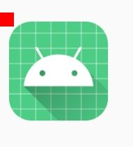
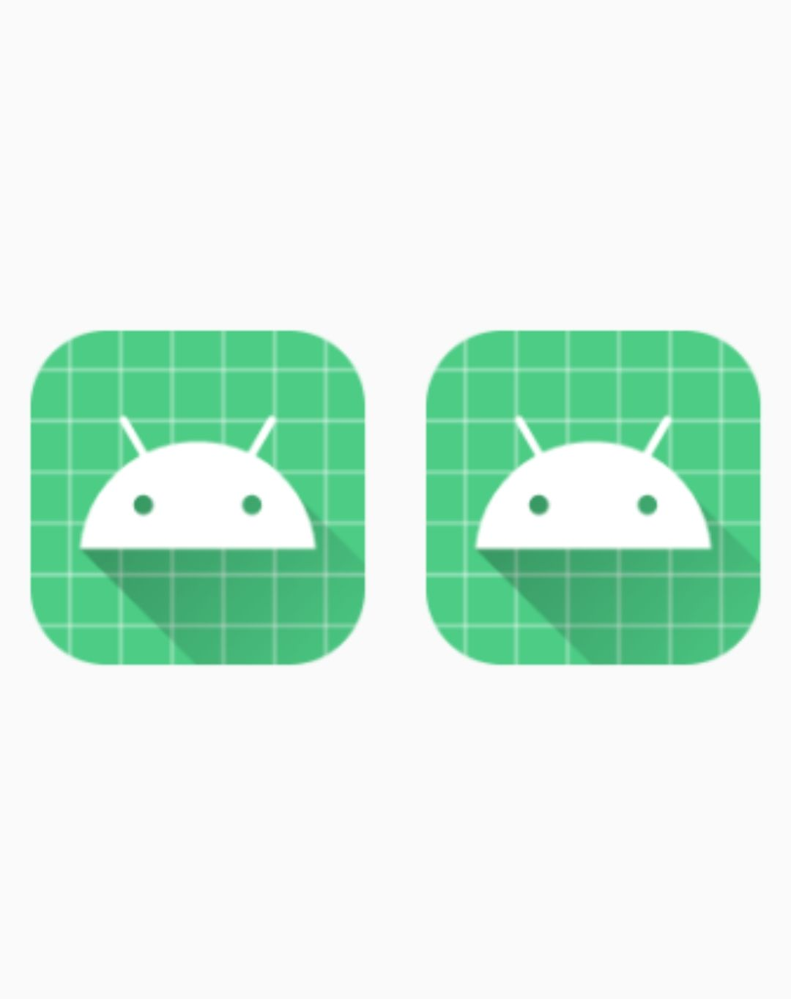
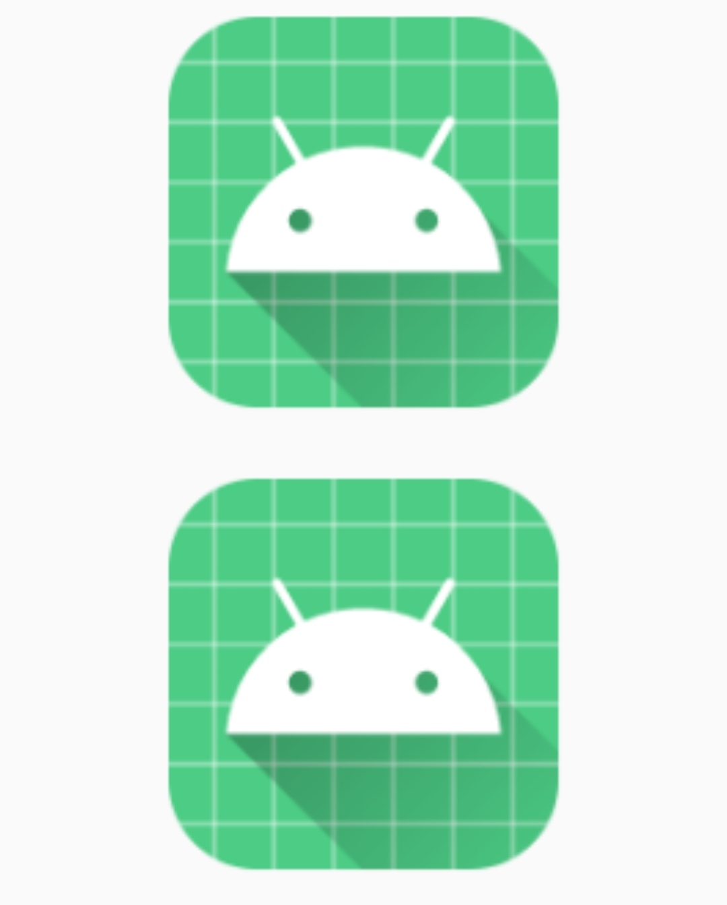

# MergeBmpUtils

`MergeBmpUtils` mainly provides you with some methods of merging bitmap

## The two bitmaps are overlaid and synthesized into one bitmap, based on the length and width of the underlying bitmap

```kotlin
iv.setImageBitmap(mergeBmp(getAppBitmap(this)!!,bitmap))
```

The operation results are as follows:

<div align="center"></div>

## The two bitmaps are overlaid and synthesized into one bitmap, which is spliced up and down. The two bitmaps are overlaid and synthesized into one bitmap, which is spliced left and right

```kotlin
// iv is an ImageView control
// We use the method in AppInfoUtils to obtain the application Bmp icon
iv.setImageBitmap(mergeBmpLR(getAppBitmap(this)!!,getAppBitmap(this)!!,true))
```

The operation results are as follows

<div align="center"></div>

## The two bitmaps are overlaid and synthesized into one bitmap, which is spliced up and down

```kotlin
// iv is an ImageView control
// We use the method in AppInfoUtils to obtain the application Bmp icon
iv.setImageBitmap(mergeBmpTB(getAppBitmap(this)!!,getAppBitmap(this)!!,true))
```

The operation results are as follows

<div align="center"></div>

