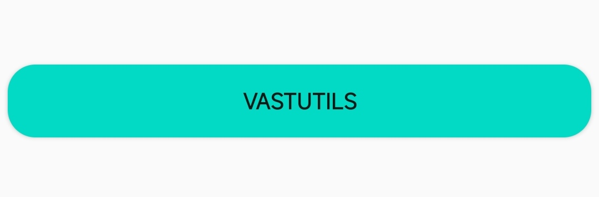
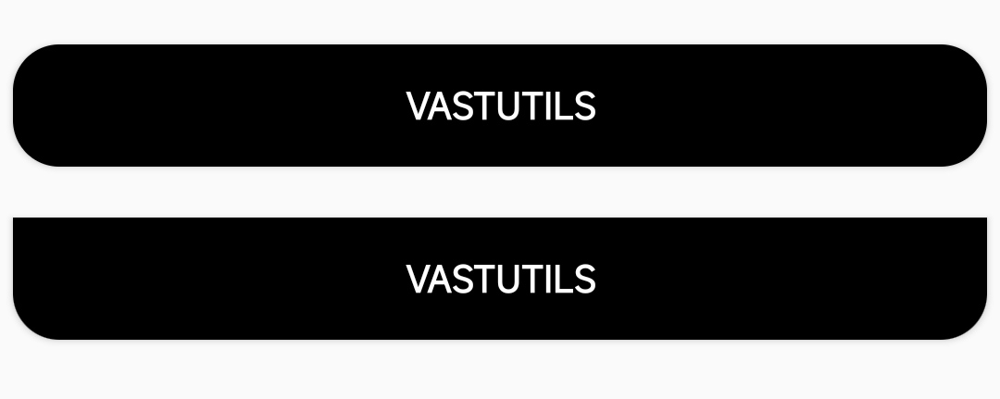
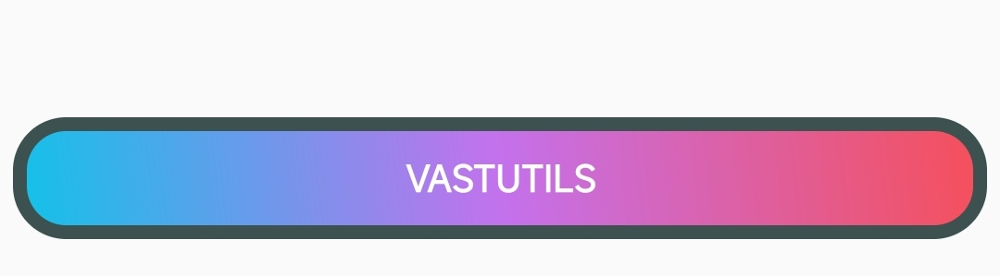
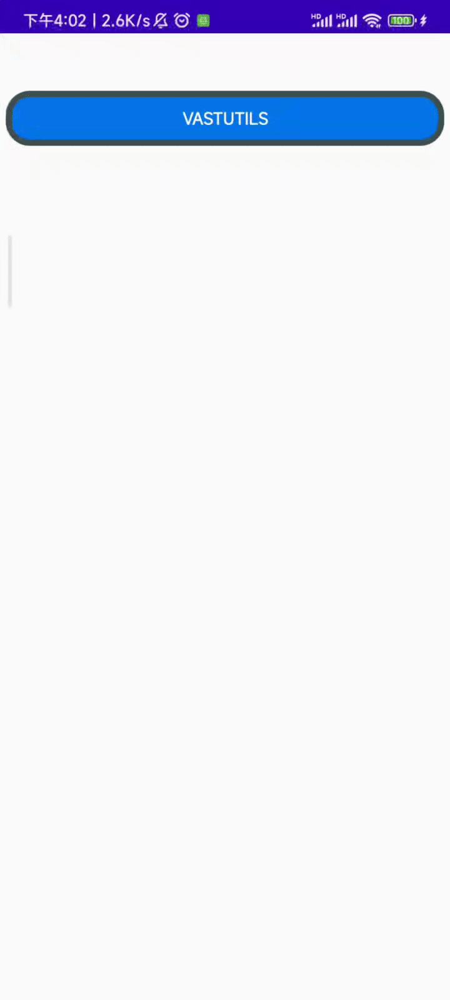

# ShapeAndStateUtils

`ShapeAndStateUtils` encapsulates [GradientDrawable](https://developer.android.google.cn/reference/android/graphics/drawable/GradientDrawable), so you don't need to create shape.xml every time you use it.

## Quick start

The following example shows you the basic usage of `ShapeAndStateUtils` .

```kotlin
val btnbk1 = ShapeAndStateUtils.create()
            .setShape(RECTANGLE)
            .setRadius(50f)
            .setBkColor(getColor(R.color.teal_200))
            .build()

mBinding.btn1.background = btnbk1
```

<div align="center"></div>

## Set shape

You can use the `setShape` to set the shape, currently supported `RECTANGLE`, `OVAL`, `LINE`, `RING` .

```kotlin
val btnbk1 = ShapeAndStateUtils.create()
            .setShape(OVAL)
            .build()
```

## Set corner radius.

When your button shape is `RECTANGLE` , you can use `setRadius` to set corner radius.

```kotlin
// Set four rounded corners with a radius of 50.0
val btnbk1 = ShapeAndStateUtils.create()
            .setShape(RECTANGLE)
            .setRadius(50f)
            .build()

// Set four corners of different radius
val btnbk2 = ShapeAndStateUtils.create()
            .setShape(RECTANGLE)
            .setRadius(0f,0f,50f,50f)
            .build()
```

<div align="center"></div>

## Set gradient

`ShapeAndStateUtils` currently supports two gradient type.

- startColor->endColor
- startColor->centerColor->endColor

```kotlin
// startColor->centerColor->endColor
val btnbk1 = ShapeAndStateUtils.create()
            .setShape(RECTANGLE)
            .setRadius(50f)
            .setGradient(45, colorHex2Int("#12c2e9"),colorHex2Int("#c471ed"),colorHex2Int("#f64f59"))
            .build()

// startColor->endColor
val btnbk2 = ShapeAndStateUtils.create()
            .setShape(RECTANGLE)
            .setRadius(50f)
            .setGradient(45, colorHex2Int("#0F2027"),colorHex2Int("#78ffd6"))
            .build()
```

<div align="center"></div>

## Set stroke

```kotlin
val btnbk1 = ShapeAndStateUtils.create()
            .setShape(RECTANGLE)
            .setRadius(50f)
            .setGradient(45, colorHex2Int("#12c2e9"),colorHex2Int("#c471ed"),colorHex2Int("#f64f59"))
            .setStroke(15f, colorHex2Int("#3E5151"))
            .build()
```

<div align="center"></div>

## Set state color

We know that sometimes for different states,we want it to show different colors, of course `ShapeAndStateUtils` provides you with `setBgColorStateList` and `setStrokeColorStateList` methods to help you to set state color, the following is an example

```kotlin
// Define state
val states = arrayOfNulls<IntArray>(6).apply {
        set(0, intArrayOf(android.R.attr.state_pressed, android.R.attr.state_enabled))
        set(1, intArrayOf(android.R.attr.state_focused, android.R.attr.state_enabled))
        set(2, intArrayOf(-android.R.attr.state_focused, android.R.attr.state_enabled))
        set(3, intArrayOf(android.R.attr.state_focused))
        set(4, intArrayOf(android.R.attr.state_window_focused))
        set(5, intArrayOf())
    }

// Define the colors in different states
val colorList = IntArray(6).apply {
        set(0, colorHex2Int("#00F260"))
        set(1, colorHex2Int("#FFFFFF"))
        set(2, colorHex2Int("#0575E6"))
        set(3, colorHex2Int("#FFFFFF"))
        set(4, colorHex2Int("#EF3B36"))
        set(5, colorHex2Int("#0575E6"))
}

val btnbk1 = ShapeAndStateUtils.create()
            .setShape(RECTANGLE)
            .setRadius(50f)
            .setStroke(15f, colorHex2Int("#3E5151"))
            .setBgColorStateList(states,colorList)
            .build()
```

<div align="center"></div>