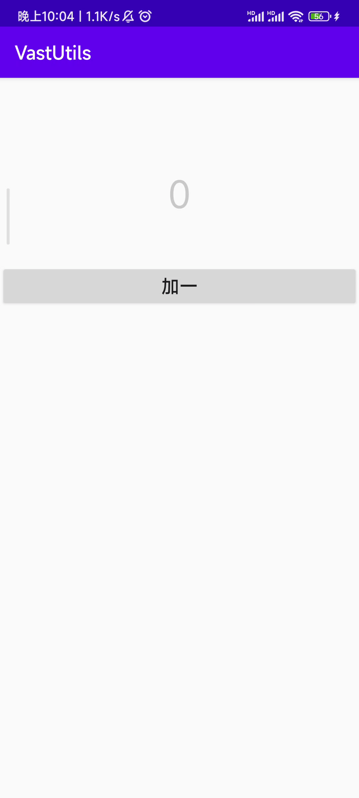

# VastBaseActivity

`VastBaseActivity` is encapsulated based on [AppCompatActivity](https://developer.android.com/reference/androidx/appcompat/app/AppCompatActivity), and it is encapsulated based on `VastBaseActivity`, as shown in the figure:

<div align="center"></div>

## Quick start

Let's take `VastVbVmActivity` as an example, you don't need to manually initialize `ViewBinding` and `ViewModel` .

```kotlin
class BaseVbActivity : VastVbVmActivity<ActivityBaseVbBinding, BaseVM>() {

    override fun initView(savedInstanceState: Bundle?) {

        mBinding.addOne.setOnClickListener {
            mViewModel.addOne()
        }

        mViewModel.count.observe(this){
            mBinding.count.text = it.toString()
        }

    }

}
```

<div align="center"></div>

## Hide ActionBar

```kotlin
class BaseVbActivity : VastVbVmActivity<ActivityBaseVbBinding, BaseVM>() {

    override fun initView(savedInstanceState: Bundle?) {
        enableActionBar = false // Hide ActionBar
        ... // Other settings
    }

}
```

<div align="center"></div>

## Full screen

```kotlin
class BaseVbActivity : VastVbVmActivity<ActivityBaseVbBinding, BaseVM>() {

    override fun initView(savedInstanceState: Bundle?) {
        enableFullScreen = true // Full screen
        ... // other settings
    }

}
```

<div align="center"></div>