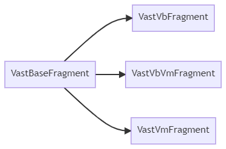

# VastBaseFragment

`VastBaseFragment` is based on [Fragment](https://developer.android.com/reference/androidx/fragment/app/Fragment.html) for encapsulation, and based on `VastBaseFragment` for secondary encapsulation, as shown in the figure :

<div align="center"></div>

## Quick start

We use `VastVbVmFragment` as an example to show you how to add it to your project:

```kotlin
class BaseVbFragment(override val layoutId: Int = 0) : VastVbVmFragment<FragmentBaseVbBinding, BaseVM>() {

    override fun initView(savedInstanceState: Bundle?) {
        mBinding.tv.setOnClickListener {
            ... //click event
        }
    }

}
```

Note that in this case you only need to set `layoutId` to the default value of 0.

Of course, if you don't use [ViewBinding](https://developer.android.com/topic/libraries/view-binding?hl=zh-cn) in your project, you can inherit `VastVmFragment`, in this case you `layoutId` needs to be set to the corresponding layout id, for example:

```kotlin
class BaseVmFragment(override val layoutId: Int = R.layout.fragment_base_vm) :VastVmActivity<BaseVM>() {

    override fun initView(savedInstanceState: Bundle?) {
        ... //Something to do
    }

}
```