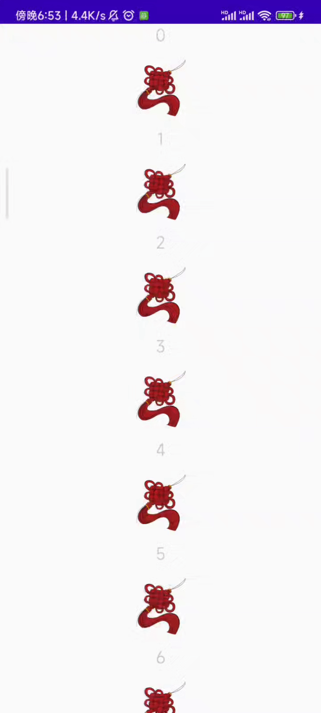

# VastAdapter

> 如果可以的话，还是推荐使用**BaseVastBindingAdapter**

## 快速开始

通过下面的示例，你可以快速的将 `VastAdapter` 运用到你的项目当中

### 实现 VastAdapterItem` 接口

我们以 `AExample` 和 `BExample` 为例:

```kotlin
// getVAdpItemType 方法返回值应该与对应的VH相同
class AExample(
    val data: String,
    var clickEventListener: VAapClickEventListener?,
    var longClickEventListener: VAdpLongClickEventListener?,
):VastAdapterItem {

    override fun setVAapClickEventListener(l: VAapClickEventListener?) {
        clickEventListener = l
    }

    override fun getVAapClickEventListener(): VAapClickEventListener? {
        return clickEventListener
    }

    override fun setVAdpLongClickEventListener(l: VAdpLongClickEventListener?) {
        longClickEventListener = l
    }

    override fun getVAdpLongClickEventListener(): VAdpLongClickEventListener? {
        return longClickEventListener
    }

    override fun getVAdpItemType(): String {
        return "person"
    }
}

class BExample(
    val drawable:Int,
    var clickEventListener: VAapClickEventListener?,
    var longClickEventListener: VAdpLongClickEventListener?
) : VastAdapterItem {

    override fun setVAapClickEventListener(l: VAapClickEventListener?) {
        clickEventListener = l
    }

    override fun getVAapClickEventListener(): VAapClickEventListener? {
        return clickEventListener
    }

    override fun setVAdpLongClickEventListener(l: VAdpLongClickEventListener?) {
        longClickEventListener = l
    }

    override fun getVAdpLongClickEventListener(): VAdpLongClickEventListener? {
        return longClickEventListener
    }

    override fun getVAdpItemType(): String {
        return "picture"
    }
}
```

### 设置对应的ViewHolder，ViewHolder需要继承自BaseVastAdapterVH

```kotlin
// AExample对应的VH
class AViewHolder(itemView: View): BaseVastAdapterVH(itemView) {
    private val tv:TextView

    override fun onBindData(item: VastAdapterItem) {
        super.onBindData(item)
        tv.text = (item as AExample).data
    }

    class Factory:BVAdpVHFactory{
        override fun onCreateViewHolder(parent: ViewGroup, viewType: Int): BaseVastAdapterVH {
            return AViewHolder(LayoutInflater.from(parent.context).inflate(R.layout.item_textview,parent,false))
        }

        override fun getVAdpVHType(): String {
            return "person" // 和Item相一致
        }
    }

    init {
        tv = itemView.findViewById(R.id.text)
    }
}

// BExample对应的VH
class BViewHolder(itemView: View) : BaseVastAdapterVH(itemView) {

    private val iv: ImageView

    override fun onBindData(item: VastAdapterItem) {
        super.onBindData(item)
        iv.setImageResource((item as BExample).drawable)
    }

    class Factory : BVAdpVHFactory {

        override fun onCreateViewHolder(
            parent: ViewGroup,
            viewType: Int
        ): BaseVastAdapterVH {
            val inflater = LayoutInflater.from(parent.context)
            val itemView: View = inflater.inflate(R.layout.item_imageview, parent, false)
            return BViewHolder(itemView)
        }

        override fun getVAdpVHType(): String {
            return "picture"
        }

    }

    init {
        iv = itemView.findViewById(R.id.item_image)
    }
}
```

### 实现Adapter

```kotlin
class BaseAdapter(
    private val items: MutableList<VastAdapterItem>,
    factories: MutableList<BaseVastAdapterVH.BVAdpVHFactory>
) : BaseVastAdapter(items, factories)
```

### 在Activity中使用

```kotlin
// 获取数据源
private val datas:MutableList<VastAdapterItem> = ArrayList()

for(i in 0..10){
    datas.add(AExample(i.toString(),null,null))
    datas.add(BExample(R.drawable.ic_knots,null,null))
}

// 设置给RecyclerView
adapter = BaseAdapter(datas, mutableListOf(AViewHolder.Factory(), BViewHolder.Factory()))

// dataRv是RecyclerView
dataRv.adapter = adapter
dataRv.layoutManager = LinearLayoutManager(this)
```

<div align="center"></div>

## 添加点击（或长按）事件

对于列表来说，点击事件是必不可少的，`VastAdapter` 支持你为列表设置通用点击事件，当然因为你的类实现了 `VastAdapterItem` 接口，因此你也可以单独为其设定点击事件。

### 通用点击事件设置

```kotlin
adapter.setOnItemClickListener(object :VastAdapter.OnItemClickListener{
            override fun onItemClick(view: View, position: Int) {
                // Something you want to do
            }
        })
adapter.setOnItemLongClickListener(object:VastAdapter.OnItemLongClickListener{
            override fun onItemLongClick(view: View, position: Int): Boolean {
                // Something you want to do
                return true
            }
        })
```

### 设置单独点击事件

注意，如果你为某一项单独定义了点击事件，那么他不再支持通用点击事件。

```kotlin
// 设置点击事件
private val click = object :VAapClickEventListener{
        override fun vAapClickEvent(view: View, pos: Int) {
            showShortMsg("Click event and pos is $pos.")
        }
    }

// 设置长按事件
private val longClick = object :VAdpLongClickEventListener{
        override fun vAdpLongClickEvent(view: View, pos: Int): Boolean {
            showShortMsg("Long click event and pos is $pos.")
            return true
        }
    }

// 在设置数据源的时候设置
for(i in 0..10){
    datas.add(AExample(i.toString(),click,null))
    datas.add(BExample(R.drawable.ic_knots,null,longClick))
}
```

<div align="center"></div>

## 添加新的数据类型

如果你想向列表中添加第三种类型的数据，你只需要以下三步：

- 定义新的数据类型，例如**CExample**，并使其实现**VastAdapterItem**接口

- 定义**CExample**对应的ViewHolder，例如**CViewHolder**

- 将其对应的**Factory**添加到adapter中
  
  ```kotlin
  adapter = BaseAdapter(datas, mutableListOf(AViewHolder.Factory(), BViewHolder.Factory() ,CViewHolder.Factory()))
  ```

## 为Adapter添加其他功能

下面的示例向你展示了为Adapter增加判断数据源是否为空的功能

```kotlin
class BaseAdapter(
    private val items: MutableList<VastAdapterItem>,
    factories: MutableList<BaseVastAdapterVH.BVAdpVHFactory>
) : BaseVastAdapter(items, factories) {

    /**
     * 如果集合为空（不包含任何元素），则返回true，否则返回false。
     * @return Boolean
     */
    fun isItemEmpty() = items.isEmpty()
}
```

当然你也可以参考示例应用

## 引用

BaseVastAdapter部分设计参考自[彻底解耦 RecyclerView.Adapter](https://puke3615.github.io/2018/08/26/Android-RecyclerView-Architecture-Design/)