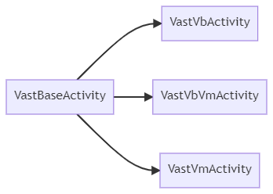
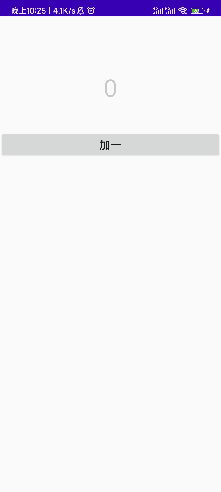
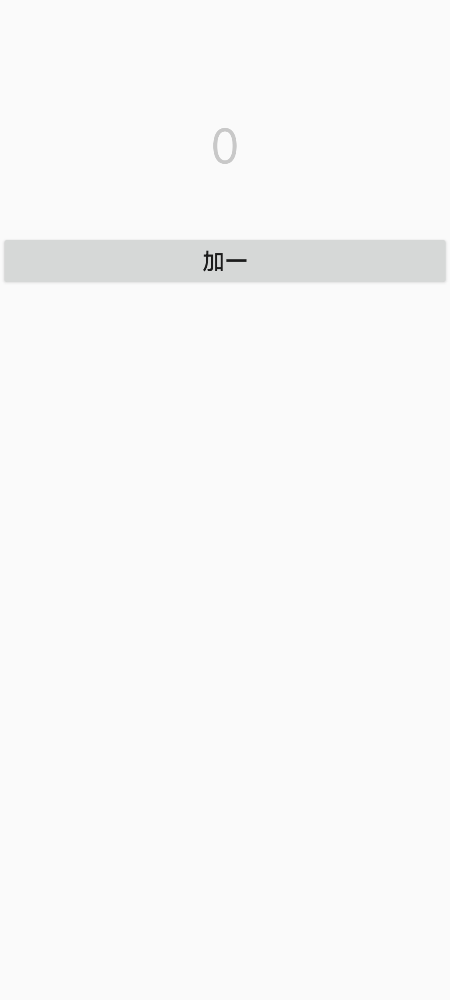

# VastBaseActivity

`VastBaseActivity` 是基于 [AppCompatActivity](https://developer.android.com/reference/androidx/appcompat/app/AppCompatActivity) 进行封装的，同时基于 `VastBaseActivity` 又进行二次封装，如图所示：

<div align="center"></div>

## 快速使用

我们以 `VastVbVmActivity` 为例，你无需去手动初始化 `ViewBinding` 和 `ViewModel`

下面展示了基本使用

```kotlin
class BaseVbActivity : VastVbVmActivity<ActivityBaseVbBinding, BaseVM>() {

    override fun initView(savedInstanceState: Bundle?) {

        mBinding.addOne.setOnClickListener {
            mViewModel.addOne()
        }

        mViewModel.count.observe(this){
            mBinding.count.text = it.toString()
        }

    }

}
```

<div align="center"></div>

## 隐藏ActionBar

```kotlin
class BaseVbActivity : VastVbVmActivity<ActivityBaseVbBinding, BaseVM>() {

    override fun initView(savedInstanceState: Bundle?) {
        enableActionBar = false // 不显示ActionBar
        ... // 其他设置
    }

}
```

<div align="center"></div>

## 启动全面屏模式

```kotlin
class BaseVbActivity : VastVbVmActivity<ActivityBaseVbBinding, BaseVM>() {

    override fun initView(savedInstanceState: Bundle?) {
        enableFullScreen = true // 启用全面屏
        ... // 其他设置
    }

}
```

<div align="center"></div>