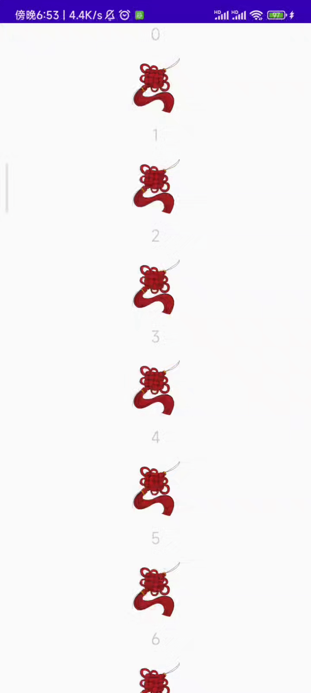

# BaseVastBindAdapter

## 快速开始

通过下面的示例，你可以快速的将**BaseVastBindAdapter**运用到你的项目当中

- 首先我们需要你的数据类实现**VastBindAdapterItem**接口，我们以**Person**和**Picture**为例

```kotlin
// getVBAdpItemType返回对应的布局id
data class Person(
    val firstName: String, val lastName: String,
    override var vbAdpClickEvent: VAapClickEvent,
    override var vbAdpLongClickEvent: VAdpLongClickEvent,
) : VastBindAdapterItem {

    override fun getVBAdpItemType(): Int {
        return R.layout.item_bind_textview
    }

}

data class Picture(
    val drawable: Int,
    override var vbAdpClickEvent: VAapClickEvent,
    override var vbAdpLongClickEvent: VAdpLongClickEvent,
) : VastBindAdapterItem {

    override fun getVBAdpItemType(): Int {
        return R.layout.item_bind_imageview
    }

}
```

- 编辑对应的layout

**注意，该列表内的所有数据布局文件中的variable里面的name必须相同，例如在这里都是item**

```xml
// Person对应的layout
<?xml version="1.0" encoding="utf-8"?>
<layout>
    <data>
        <variable
            name="item"
            type="com.gcode.vastutils.basebindadpexample.model.Person" />
    </data>
    <LinearLayout xmlns:android="http://schemas.android.com/apk/res/android"
        android:orientation="vertical"
        android:layout_width="match_parent"
        android:layout_height="wrap_content">
        <TextView
            android:layout_width="match_parent"
            android:layout_height="wrap_content"
            android:gravity="center"
            android:text="@{item.firstName}"/>
        <TextView
            android:layout_width="match_parent"
            android:layout_height="wrap_content"
            android:gravity="center"
            android:text="@{item.lastName}"/>
    </LinearLayout>
</layout>

// Picture对应的layout
<?xml version="1.0" encoding="utf-8"?>
<layout>
    <data>
        <variable
            name="item"
            type="com.gcode.vastutils.basebindadpexample.model.Picture" />
    </data>
    <LinearLayout xmlns:android="http://schemas.android.com/apk/res/android"
        android:layout_width="match_parent"
        android:layout_height="wrap_content"
        android:orientation="vertical">
        <ImageView
            android:id="@+id/item_image"
            android:layout_width="100dp"
            android:layout_height="100dp"
            android:src="@{item.drawable}"
            android:contentDescription="@string/picture"
            android:layout_gravity="center_horizontal"/>
    </LinearLayout>
</layout>
```

- 实现Adapter

```kotlin
class BaseBindingAdapter(
    private val dataSource:MutableList<VastBindAdapterItem>
):BaseVastBindAdapter(dataSource){

    override fun setVariableId(): Int {
        return BR.item
    }

}
```

- 在Activity中使用

```kotlin
private val datas:MutableList<VastBindAdapterItem> = ArrayList()

for(i in 0..10){
    datas.add(Person(i.toString(),i.toString(),null,null))
    datas.add(Picture(R.drawable.ic_knots,null,null))
}

// 设置给RecyclerView
val adapter = BaseBindingAdapter(datas)
dataRv.adapter = adapter
dataRv.layoutManager = LinearLayoutManager(this)
```

<div align="center"></div>

## 添加点击（或长按）事件

对于列表来说，点击事件是必不可少的，下面的示例为你演示了如何为item添加对应的点击（或长按）事件

```kotlin
// 设置点击事件
private val click:VAapClickEvent = { _: View, pos:Int->
    showShortMsg("Hello,User.And position is $pos")
}

private val longClick:VAdpLongClickEvent = { _: View, pos:Int->
    showShortMsg("Hello,User.And position is $pos")
    true
}

// 在设置数据源的时候设置
for(i in 0..10){
    datas.add(Person(i.toString(),i.toString(),click,null))
    datas.add(Picture(R.drawable.ic_knots,null,longClick))
}
```

<div align="center"></div>

## 为Adapter添加其他功能

下面的示例向你展示了为Adapter增加判断数据源是否为空的功能

```kotlin
class BaseBindingAdapter(
    private val dataSource:MutableList<VastBindAdapterItem>
):BaseVastBindAdapter(dataSource) {

    /**
     * 如果集合为空（不包含任何元素），则返回true，否则返回false。
     * @return Boolean
     */
    fun isItemEmpty() = items.isEmpty()

    override fun setVariableId(): Int {
        return BR.item
    }

}
```

当然你也可以参考示例应用

## @BindingAdapter使用

在使用DataBinding时，我们有时需要自定义一些内容，下面的示例为你演示了如何在BaseVastBindAdapter里面使用@BindingAdapter

我们以**android:src**为例

```kotlin
class BaseBindingAdapter(
    private val dataSource:MutableList<VastBindAdapterItem>
):BaseVastBindAdapter(dataSource) {
    companion object {
        @JvmStatic @BindingAdapter("android:src")
        fun setImageUri(view: ImageView, imageUri: String?) {
            if (imageUri == null) {
                view.setImageURI(null)
            } else {
                view.setImageURI(Uri.parse(imageUri))
            }
        }
    }

    override fun setVariableId(): Int {
        return BR.item
    }

}
```