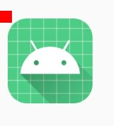
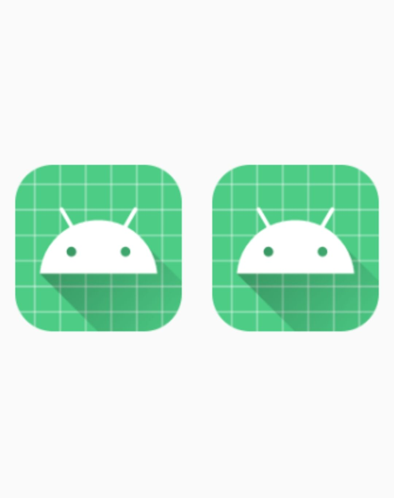
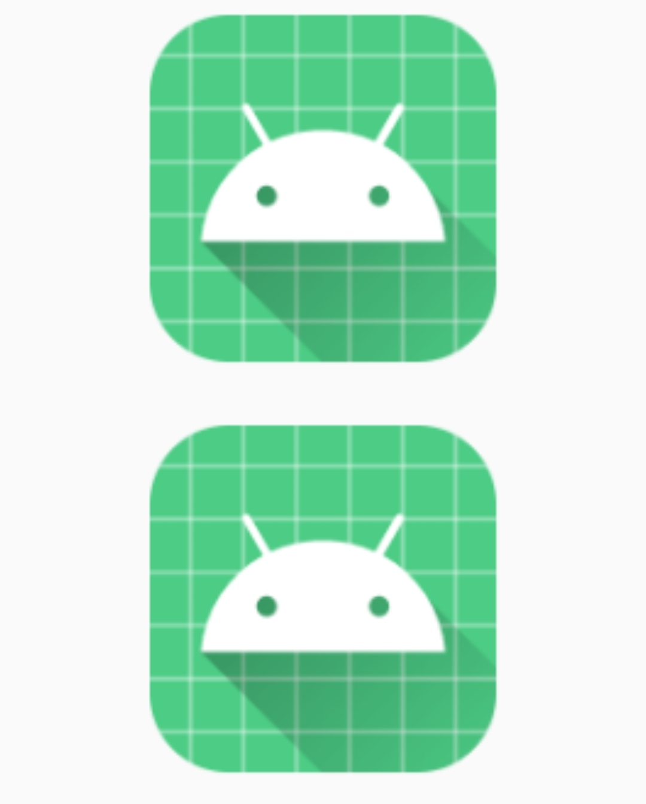

# MergeBmpUtils

**MergeBmpUtils**主要为你提供了合并Bitmap的一些方法

## 把两个位图覆盖合成为一个位图，以底层位图的长宽为基准

```kotlin
iv.setImageBitmap(mergeBmp(getAppBitmap(this)!!,bitmap))
```

运行结果如下

<div align="center"></div>

## 把两个位图覆盖合成为一个位图，左右拼接

```kotlin
// iv是一个ImageView控件
// 我们使用AppInfoUtils里面的方法获取应用Bmp图标
iv.setImageBitmap(mergeBmpLR(getAppBitmap(this)!!,getAppBitmap(this)!!,true))
```

运行结果如下

<div align="center"></div>

## 把两个位图覆盖合成为一个位图，上下拼接

```kotlin
// iv是一个ImageView控件
// 我们使用AppInfoUtils里面的方法获取应用Bmp图标
iv.setImageBitmap(mergeBmpTB(getAppBitmap(this)!!,getAppBitmap(this)!!,true))
```

运行结果如下

<div align="center"></div>