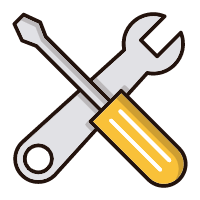

<p align="center">
<center style="display:flex;justify-content:center">
<p style="font-size:20px;">With</p>
</center>

<p align="center" p style="font-size:30px;">VastUtils</p>

<p align="center">一款加快你安卓开发的安卓工具集
</p>

<p align="center">


</p>

## 🚀 快速使用

### VastNetStateLayout

一款支持自定义网络状态的布局控件

```gradle
implementation 'io.github.sakurajimamaii:VastNetStateLayout:0.0.2'
```

### VastTools

包含了常用的安卓工具集

```gradle
implementation 'io.github.sakurajimamaii:VastTools:0.0.4'
```

### VastAdapter

帮助你快速构建匹配RecyclerView的适配器

```gradle
implementation 'io.github.sakurajimamaii:VastAdapter:0.0.2'
```

### VastSwipeView

基于RecyclerView开发的仿QQ滑动控件

```gradle
implementation 'io.github.sakurajimamaii:VastSwipeListView:0.0.2'
```


