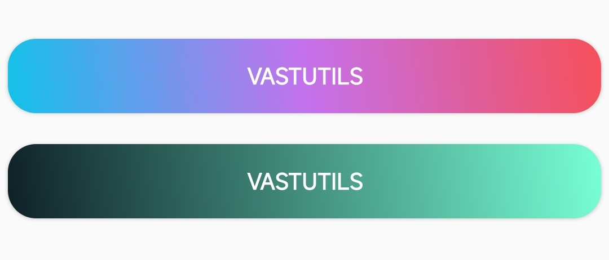

# ShapeAndStateUtils

ShapeAndStateUtils是对[GradientDrawable](https://developer.android.google.cn/reference/android/graphics/drawable/GradientDrawable?hl=en)进行了封装，不必每次使用都需要创建shape.xml

## 快速开始

下面的示例为你演示了 `ShapeAndStateUtils` 的基础使用

```kotlin
val btnbk1 = ShapeAndStateUtils.create()
            .setShape(RECTANGLE)
            .setRadius(50f)
            .setBkColor(getColor(R.color.teal_200))
            .build()

mBinding.btn1.background = btnbk1
```

<div align="center"></div>

## 设置形状

你可以使用 `setShape` 方法去设置形状，目前支持
`RECTANGLE` ， `OVAL` ， `LINE` ， `RING`四种形状

```kotlin
val btnbk1 = ShapeAndStateUtils.create()
            .setShape(OVAL)
            .build()
```

## 设置圆角

当你的按钮形状是 `RECTANGLE` 时，你可以通过下列方式设置圆角

```kotlin
// 设置四个圆角，半径均为50.0
val btnbk1 = ShapeAndStateUtils.create()
            .setShape(RECTANGLE)
            .setRadius(50f)
            .build()

// 设置四个大小不同的圆角
val btnbk2 = ShapeAndStateUtils.create()
            .setShape(RECTANGLE)
            .setRadius(0f,0f,50f,50f)
            .build()
```

<div align="center"></div>

## 设置渐变

ShapeAndStateUtils目前支持两种渐变颜色形式

- startColor->endColor
- startColor->centerColor->endColor

```kotlin
// startColor->centerColor->endColor
val btnbk1 = ShapeAndStateUtils.create()
            .setShape(RECTANGLE)
            .setRadius(50f)
            .setGradient(45, colorHex2Int("#12c2e9"),colorHex2Int("#c471ed"),colorHex2Int("#f64f59"))
            .build()

// startColor->endColor
val btnbk2 = ShapeAndStateUtils.create()
            .setShape(RECTANGLE)
            .setRadius(50f)
            .setGradient(45, colorHex2Int("#0F2027"),colorHex2Int("#78ffd6"))
            .build()
```

<div align="center"></div>

## 添加边框

```kotlin
val btnbk1 = ShapeAndStateUtils.create()
            .setShape(RECTANGLE)
            .setRadius(50f)
            .setGradient(45, colorHex2Int("#12c2e9"),colorHex2Int("#c471ed"),colorHex2Int("#f64f59"))
            .setStroke(15f, colorHex2Int("#3E5151"))
            .build()
```

<div align="center"></div>

以上便是 `ShapeAndStateUtils` 的基础使用

## 定义不同状态下的颜色

我们知道有时候对于控件的不同状态，我们希望其呈现不同的颜色，当然 `ShapeAndStateUtils` 为你提供了 `setBgColorStateList` 和 `setStrokeColorStateList` 方法来帮助你实现此功能，以下为示例

```kotlin
// 定义状态
val states = arrayOfNulls<IntArray>(6).apply {
        set(0, intArrayOf(android.R.attr.state_pressed, android.R.attr.state_enabled))
        set(1, intArrayOf(android.R.attr.state_focused, android.R.attr.state_enabled))
        set(2, intArrayOf(-android.R.attr.state_focused, android.R.attr.state_enabled))
        set(3, intArrayOf(android.R.attr.state_focused))
        set(4, intArrayOf(android.R.attr.state_window_focused))
        set(5, intArrayOf())
    }

// 定义不同状态下对应的颜色
val colorList = IntArray(6).apply {
        set(0, colorHex2Int("#00F260"))
        set(1, colorHex2Int("#FFFFFF"))
        set(2, colorHex2Int("#0575E6"))
        set(3, colorHex2Int("#FFFFFF"))
        set(4, colorHex2Int("#EF3B36"))
        set(5, colorHex2Int("#0575E6"))
}

val btnbk1 = ShapeAndStateUtils.create()
            .setShape(RECTANGLE)
            .setRadius(50f)
            .setStroke(15f, colorHex2Int("#3E5151"))
            .setBgColorStateList(states,colorList)
            .build()
```

<div align="center"></div>
